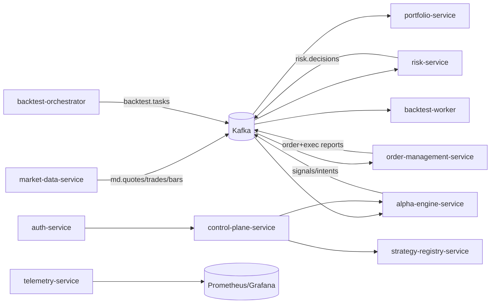

# Alpaca HFT Platform (Java 25 + Spring Boot 4)

## 1. Overview

Production-oriented, event-driven architecture for live trading, deterministic replay, and horizontally scalable backtesting.



### Event Flow
1. Market data is ingested from Alpaca and normalized into canonical events.
2. Alpha strategies consume market events and emit signals and intents.
3. Risk service performs deterministic checks and emits ALLOW/REJECT/THROTTLE.
4. OMS submits approved orders to Alpaca Trader API and emits lifecycle events.
5. Portfolio service updates positions/PnL/exposure projections.
6. Backtest orchestrator shards jobs; stateless workers replay deterministically.

## 2. Services Explained

- `market-data-service`: Alpaca market stream adapter + event normalization + Kafka publishing.
- `alpha-engine-service`: one virtual thread per strategy task; live and replay-compatible runtime.
- `risk-service`: hard/soft limits; no side effects; replay-safe deterministic rules.
- `order-management-service`: order state transitions + broker adapter to Alpaca.
- `portfolio-service`: positions, PnL, exposure from execution streams.
- `backtest-orchestrator`: splits jobs by strategy/parameter/symbol/time and publishes tasks.
- `backtest-worker`: deterministic replay engine with seeded RNG/event-time execution.
- `strategy-registry-service`: strategy versioning, configs, and deployment metadata.
- `control-plane-service`: start/stop, overrides, kill switch.
- `telemetry-service`: metrics/tracing aggregation endpoints.
- `auth-service`: OIDC/JWT/RBAC.

## 3. Local Development Setup

### Prerequisites
- Java 25
- Maven 3.9+
- Docker + Docker Compose

### Infra boot (example)
```bash
docker compose up -d kafka redis postgres questdb
```

Suggested env vars:
- `KAFKA_BOOTSTRAP_SERVERS=localhost:9092`
- `ALPACA_API_KEY=...`
- `ALPACA_API_SECRET=...`
- `SPRING_PROFILES_ACTIVE=local`

## 4. Running Services

```bash
mvn -pl services/market-data-service spring-boot:run
mvn -pl services/alpha-engine-service spring-boot:run
mvn -pl services/risk-service spring-boot:run
mvn -pl services/order-management-service spring-boot:run
```

Each service exposes:
- `/actuator/health`
- `/actuator/prometheus`

## 5. API Documentation

### REST (control plane + orchestration)
- `POST /api/backtests/launch`
- `POST /api/control/strategy/start?strategyId=...`
- `POST /api/control/strategy/stop?strategyId=...`
- `POST /api/control/kill-switch`

### gRPC
Contracts are under `common/proto/`.
- `TradingControlService.StartStrategy`
- `TradingControlService.StopStrategy`

## 6. Kafka Topics

Defined in `infrastructure/kafka/topics.yaml`.

| Topic | Purpose | Key / Partition Strategy |
|---|---|---|
| `md.quotes.v1` | normalized quotes | `symbol` |
| `md.trades.v1` | normalized trades | `symbol` |
| `md.bars.v1` | normalized bars | `symbol` |
| `alpha.signals.v1` | strategy signals | `strategyId` |
| `alpha.position-intents.v1` | position intents | `strategyId` |
| `risk.decisions.v1` | risk decisions | `strategyId` |
| `oms.orders.v1` | order lifecycle | `symbol` |
| `oms.exec-reports.v1` | broker execution reports | `symbol` |
| `portfolio.updates.v1` | positions/PnL snapshots | `strategyId` |
| `backtest.tasks.v1` | replay tasks | `strategyId` |

## 7. Deployment Guide

### Kubernetes
- Priority classes and PDBs are in `infrastructure/k8s/base.yaml`.
- Helm defaults are in `infrastructure/helm/values.yaml`.
- Terraform namespace bootstrap is in `infrastructure/terraform/main.tf`.

### Helm (example)
```bash
helm upgrade --install hft-platform infrastructure/helm -f infrastructure/helm/values.yaml
```

## 8. Backtesting Guide

1. Register strategy version in strategy-registry-service.
2. Launch shard generation via `POST /api/backtests/launch` (or bulk API extension).
3. Scale `backtest-worker` deployment with HPA by queue lag.
4. Ensure deterministic replay via fixed seed + event-time clock.

## 9. Observability

- OpenTelemetry traces in all services.
- Prometheus metrics from actuator.
- Grafana dashboards should include:
  - p50/p95/p99 latency (risk + OMS + broker roundtrip)
  - Kafka lag by topic/group
  - throughput (ticks/s, signals/s, orders/s)
  - rejects/throttles and drawdown alarms

## 10. Failure Handling

- Circuit breakers on broker and external dependencies.
- Retry with backoff and idempotency keys for order submission.
- Reconnect + replay from Kafka offsets on restarts.
- Kill switch endpoint for global trading halt.

## 11. Production Runbook

- Incident response checklist: `docs/runbooks/incident-response.md`
- API quick reference: `docs/api/rest.md`
- Event flow doc: `docs/architecture/event-flow.md`

## Security Baseline

- mTLS between services/service mesh.
- Vault/KMS-backed secrets.
- OIDC + JWT RBAC in auth service.
- Signed container artifacts and provenance gates in CI/CD.

## CI/CD

- GitHub Actions pipeline: build, verify, dependency scan.
- Argo Rollouts canary: 1% → 5% → 25% → 100%.

## Notes

This repository provides a production-ready foundation with real Kafka integration, service boundaries, deterministic replay primitives, CI/CD rollout strategy, and operational guardrails. Extend each service with venue-specific execution logic, full schema registry integration, and full compliance retention policies per jurisdiction.
