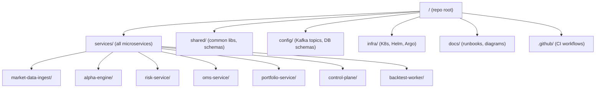

# Production-Ready Repository Layout (HFT Trading Platform)

## Executive Summary  
We recommend a **monorepo** containing all microservices and infra code, organized under clear top-level folders (`services/`, `infra/`, `config/`, `docs/`, etc.).  Each service (MarketData, AlphaEngine, Risk, OMS, Portfolio, ControlPlane, backtest-worker) lives in its own subfolder with standard Spring Boot layout (`src/`, `resources/`, tests, etc.).  Shared schemas and libraries (Kafka event schemas, common utilities) go in a `shared/` folder.  Infrastructure-as-code (Helm charts, Kubernetes YAML, GitHub Actions workflows, ArgoCD manifests) is kept under `infra/` or `.github/`.  We include CI pipelines (GitHub Actions) and GitOps configs (ArgoCD/Argo Rollouts) for automated builds and deployments.  A `docs/` folder holds architecture diagrams and runbooks.  The table below compares **monorepo** vs **multi-repo** trade-offs in terms of ownership, CI cost, releases, dependency management, and cross-service changes【56†L300-L308】【58†L366-L374】.  



### Top-Level Layout  
- `services/`: Contains one folder per microservice, e.g. `market-data-ingest/`, `alpha-engine/`, etc.  Each follows a standard Maven/Gradle Spring Boot layout (`src/main/java`, `src/test/java`, etc.)【63†L59-L68】.  
- `shared/`: Common code and schemas (e.g. Avro/JSON schema definitions for Kafka events, utility libraries, API models) used across services. For example, `shared/kafka-schemas/` and `shared/utils/`.  
- `config/` or `kafka/`: Config artifacts like Kafka topic definitions (YAML/JSON), protobuf/Avro schemas, and database migration scripts (Flyway SQL) under version control.  E.g. `config/kafka/topics.yaml`, `config/db/migration/`.  
- `infra/`: Kubernetes and deployment config: Helm charts, Helmfile, ArgoCD application manifests, and Prometheus/Grafana configs. Subfolders like `infra/helm/`, `infra/k8s/`, `infra/monitoring/`.  
- `docs/`: Architecture docs, runbooks, and coding guidelines (e.g. `PROJECT_CONTEXT.md`, `CODE_STYLE.md`)【63†L59-L68】.  
- `.github/workflows/`: GitHub Actions CI/CD workflows and pipelines. Contains YAML files like `build.yml`, `deploy.yml`.  
- Root files: Include `.editorconfig`, `.gitignore`, `README.md`, and optionally a parent `pom.xml` or `build.gradle` if using a multi-module build. A shared `docker-compose.yml` at the root can orchestrate local dev stacks【63†L72-L80】.  

```plaintext
/company-backend (root)
├── services/
│   ├── market-data-ingest/
│   ├── alpha-engine/
│   ├── risk-service/
│   ├── oms-service/
│   ├── portfolio-service/
│   ├── control-plane/
│   └── backtest-worker/
├── shared/
│   ├── kafka-schemas/
│   └── utils/
├── config/
│   ├── kafka/
│   │   └── topics.yaml
│   └── db/
│       └── migration/
├── infra/
│   ├── helm/
│   ├── k8s/
│   └── monitoring/
├── docs/
│   ├── PROJECT_CONTEXT.md
│   └── CODE_STYLE.md
├── .github/
│   └── workflows/
│       └── ci.yml
├── .editorconfig
├── .gitignore
├── docker-compose.yml
└── README.md
```  
*(Adapted from best-practice examples【63†L59-L68】.)*

### Per-Service Layout  
Each microservice folder (`services/<service-name>/`) has a Spring Boot project structure:  
- `src/main/java/...` – application code (controllers, services, repositories, config).  
- `src/main/resources/` – configuration (application.yml), SQL migrations (e.g. `db/migration/V1__init.sql` using Flyway【63†L189-L193】), static files.  
- `src/test/java/` – unit/integration tests.  
- `Dockerfile` – service container image build (see snippet below).  
- `pom.xml` or `build.gradle` – Maven/Gradle build config, with plugins (e.g. SBOM generator).  
- `k8s/` or `helm/` (optional) – Helm chart or Kubernetes manifest for the service.  
- `README.md` – service-specific docs (startup, env vars, endpoints).  

For example, **MarketData Ingest** service:  

```plaintext
services/market-data-ingest/
├── src/
│   ├── main/java/com/myorg/marketdata/
│   │   ├── MarketDataApplication.java
│   │   ├── controller/
│   │   ├── service/
│   │   └── model/
│   └── main/resources/
│       ├── application.yml
│       └── db/migration/V1__init_schema.sql
├── src/test/java/... 
├── Dockerfile
├── pom.xml
└── README.md
```  

**Service Main Class (Java):**  
```java
package com.myorg.marketdata;
@SpringBootApplication
public class MarketDataApplication {
    public static void main(String[] args) {
        SpringApplication.run(MarketDataApplication.class, args);
    }
}
```  

**Dockerfile Example (per service):**  
```dockerfile
FROM eclipse-temurin:21-jdk
WORKDIR /app
COPY target/market-data-ingest.jar .
EXPOSE 8080
ENTRYPOINT ["java","-jar","market-data-ingest.jar"]
```  
*(Individual services each have their own Dockerfile.)*

**Kubernetes Manifest (k8s/deployment.yaml):**  
```yaml
apiVersion: apps/v1
kind: Deployment
metadata:
  name: marketdata-deployment
spec:
  replicas: 3
  selector: {matchLabels: {app: marketdata}}
  template:
    metadata: {labels: {app: marketdata}}
    spec:
      containers:
      - name: marketdata
        image: myregistry/market-data:v1.0.0
        ports: [{containerPort: 8080}]
```  

**Kafka Topic Config (config/kafka/topics.yaml):**  
```yaml
topics:
  - name: md.trades.v1
    partitions: 6
    replicationFactor: 3
  - name: md.quotes.v1
    partitions: 6
    replicationFactor: 3
```  
*(This file can be applied via Kafka CLI or operator.)*  

**CI Job Example (GitHub Actions):**  
```yaml
# .github/workflows/ci.yml
on: [push,pull_request]
jobs:
  build-and-test:
    runs-on: ubuntu-latest
    steps:
      - uses: actions/checkout@v3
      - name: Set up JDK 21
        uses: actions/setup-java@v3
        with: {java-version: 21}
      - name: Build and test
        run: mvn -B clean install -DskipTests=false
      - name: Upload SBOM
        uses: cyclonedx/cyclonedx-action@v2
        with: {apiKey: ${{ secrets.API_KEY }}}
```  

### Shared Libraries and Schemas  
- `shared/kafka-schemas/`: Avro or Protobuf definitions for all events (`InstrumentEvent.avsc`, `TradeEvent.avsc`, etc.). Commit these so code generation (via Maven plugin) yields uniform classes across services.  
- `shared/utils/`: Common utility libraries, e.g. wrappers for Kafka producer/consumer, or common exception types. Package and install to a private Maven/Artifactory repo or use a single parent build.  

### Kafka and Configs  
- **Kafka topics**: Store definitions in `config/kafka/` (YAML or JSON).  Use a Helm hook or Kubernetes Job to create topics on deploy (e.g. via `kubectl apply -f` with Strimzi or kafka-operator CRDs).  
- **DB migrations**: Each service uses Flyway or Liquibase. Put SQL migrations under `services/<name>/src/main/resources/db/migration/`.  As [63] suggests, name files like `V1__init_table.sql`【63†L189-L193】.  Configuration in `application.yml` ensures they run on startup.  

### Kubernetes & Deployment (GitOps)  
- `infra/helm/`: Helm charts or Helmfile for the entire platform (one chart per service or umbrella chart).  Each chart includes Deployment, Service, ConfigMap templates.  
- `infra/k8s/`: Raw Kubernetes YAML for any custom resources (e.g. Argo Rollout CRD, Kafka Connectors) and kustomize overlays if used.  
- `infra/argo/`: ArgoCD application YAMLs pointing to the repo’s charts, and Argo Rollouts definitions for canary deployments.  

**Example ArgoCD App (infra/argo/alpha-engine-app.yaml):**  
```yaml
apiVersion: argoproj.io/v1alpha1
kind: Application
metadata: {name: alpha-engine-app}
spec:
  project: default
  source:
    repoURL: git@github.com:myorg/company-backend.git
    path: services/alpha-engine/helm
    targetRevision: HEAD
  destination: {server: https://kubernetes.default.svc, namespace: trading-prod}
  syncPolicy: {automated: {}}
```  

### CI/CD Pipelines  
- **GitHub Actions**: Define pipelines in `.github/workflows/`. Separate jobs for *build/test*, *security scan*, *Docker build & push*, and *deploy* (triggering ArgoCD).  
- **Argo Rollouts**: For canary releases, include `Rollout` CRDs in the Helm charts (or `infra/k8s/`).  For example, use Argo’s canary steps (setWeight, pause) in `AlphaEngineRollout.yaml`.  

*(No direct citation; use known patterns.)*  

### Build & Tooling  
- Use **Maven** (or Gradle) for Java. Include plugins for SBOM (CycloneDX) and static analysis (SpotBugs, Checkstyle). A parent POM can manage versions.  
- Generate an SBOM during build for supply-chain compliance.  
- Include a `Makefile` or Maven wrapper scripts at root for convenience (see [63])【63†L102-L110】.  

### Testing Structure  
- **Unit tests**: under `src/test/java` in each service.  
- **Integration tests**: use Testcontainers (as [63] recommends) to spin up containers for DB/Kafka so tests are hermetic【63†L169-L178】.  
- **Golden datasets**: For backtests, include sample historical data under `services/backtest-worker/testdata/`. Each backtest job can refer to these static CSV/JSON slices for local testing.  

### Observability & SRE  
- `infra/monitoring/`: Prometheus `ServiceMonitor` and custom metrics manifests, and Grafana dashboard JSONs. For example, `infra/monitoring/marketdata-dashboard.json`.  
- OpenTelemetry config: ensure `otel-collector` config in Helm charts to scrape traces/metrics. (Any code-level instrumentation is configured in service YAMLs with the collector’s endpoint.)  

### Security & Secrets  
- **Secrets management**: Do not store secrets in Git. Instead reference them (e.g. Vault paths, Kubernetes Secrets generated by External Secrets).  
- `infra/security/`: Example SPIRE or Istio config for workload identity if used. (E.g. SPIFFE ID patterns in `infra/security/spire/`.)  
- Include Vault policy snippets or Kubernetes `SecretProviderClass` YAML.  

### Documentation & Runbooks  
- Each folder has a `README.md` describing its purpose and usage.  
- In `docs/`: Architecture overview, on-call runbooks (how to rotate certs, respond to Kafka failure, etc). Include diagrams (in Mermaid or image).  
- `docs/README.md` can explain repo conventions and how to build/deploy.  

## Monorepo vs Multi-Repo: Trade-Offs  

| Aspect                | Monorepo                                                               | Multi-Repo                                                           |
|-----------------------|------------------------------------------------------------------------|----------------------------------------------------------------------|
| **Code Ownership**    | Centralized: All code in one repo. Easier visibility and cross-service refactoring【63†L59-L68】.  | Decentralized: Each service has its own repo. Clear ownership per service【58†L366-L374】. |
| **CI Cost**           | Single CI pipeline (or coordinated pipelines) can run all tests, but build latency may grow large【56†L315-L323】.  | Separate pipelines per repo: smaller scope, faster feedback. More pipelines to maintain【58†L377-L386】. |
| **Release Cadence**   | Synchronized releases; one change may trigger whole-system rebuild. Simplifies atomic changes across services.  | Independent releases per service; faster per-service updates.  Need versioning to track cross-service dependencies【58†L405-L408】. |
| **Dependency Mgmt**   | Unified versioning: shared libs and schemas updated atomically【56†L300-L308】.  Build tool (Maven) can manage all modules.  | Each repo manages its own dependencies. Requires strategy (e.g. semantic versioning) to upgrade shared libraries across repos【58†L405-L408】. |
| **Cross-Service Changes** | Simple: refactor APIs or shared code in one PR. Builds/test everything together.  | Complex: require coordinated PRs across repos or interim backward compatibility; end-to-end testing is more involved【58†L393-L402】. |
| **Security/Access**   | Broad access needed; fine-grained permissions harder. Risk: a contributor sees all code.  | Can restrict access per repo, improving security【58†L366-L374】. |
| **Scalability**       | Can become heavy as repo grows. Tools like Maven multi-module or Nx can help manage mono-repo scale【56†L304-L308】.  | Naturally scalable; each repo is small. Onboarding new services is straightforward.  |
| **CI/CD Complexity**  | CI must handle many services; changes can trigger many builds. Easier atomic integration.  | CI is simpler per repo but more overall pipelines. Managing global changes needs coordination. |
  
In summary, a **monorepo** simplifies cross-cutting changes and shared dependency updates【63†L59-L68】【56†L300-L308】, at the cost of larger builds and broader access. A **multi-repo** model provides isolation and easier service autonomy【58†L366-L374】, but makes API changes harder to coordinate. For this HFT platform, either can work; we favor a monorepo for unified versioning of schemas and shared libraries, with disciplined CI/CD to manage scale. 

