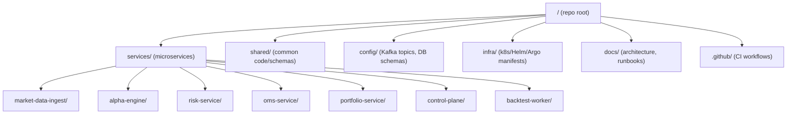
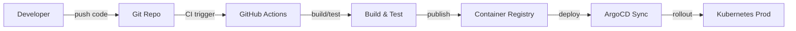

# Alpaca Paper Trading Microservices

This directory contains individual Spring Boot microservices for the Alpaca paper trading platform, each maintained as a git submodule with its own repository.

## Services

Each service is a standalone Spring Boot application with independent deployment, versioning, and testing:

- **market-data-ingest/** - Market data feed adapters (Alpaca integration, normalization, watermarking)
- **alpha-engine/** - Strategy runtime engine (virtual-thread I/O, bounded CPU pools)
- **risk-service/** - Pre-trade risk validation and compliance checks
- **oms-service/** - Order Management System (order state machine, broker adapters)
- **portfolio-service/** - Position tracking and P&L reconciliation
- **control-plane/** - Strategy lifecycle, policy, and orchestration APIs
- **backtest-worker/** - Batch backtesting engine (historical replay)

## Repository Structure

Each service repository contains:
```
<service-name>/
├── pom.xml                          # Maven configuration
├── Dockerfile                       # Container image definition
├── README.md                        # Service documentation
├── src/
│   ├── main/
│   │   ├── java/com/alpaca/...     # Application code
│   │   └── resources/              # Configuration and migrations
│   └── test/                       # Unit and integration tests
├── .mvnw/.mvnw.cmd                # Maven wrapper
└── .gitignore                      # Git ignore rules
```

## Cloning with Submodules

To clone this repository with all service submodules:

```bash
git clone --recurse-submodules https://github.com/jaykumarpatil/alpaca-paper-trading.git
```

Or if you've already cloned without submodules:

```bash
git submodule update --init --recursive
```

## Building a Service

Each service uses Maven for building:

```bash
cd services/<service-name>
mvn clean package
```

This generates a JAR in `target/<service-name>.jar`.

## Running a Service Locally

With Docker:
```bash
cd services/<service-name>
docker build -t alpaca-<service-name>:latest .
docker run -p 8080:8080 alpaca-<service-name>:latest
```

Or directly with Java 21+:
```bash
cd services/<service-name>
mvn spring-boot:run
```

## Dependencies

All services share the following baseline dependencies:
- **Web Framework:** Spring Boot Web for REST APIs
- **Messaging:** Spring Kafka for event streaming
- **Observability:** Micrometer for metrics, OpenTelemetry for tracing
- **Data:** Spring Data JPA, PostgreSQL driver

## Configuration

Each service reads configuration from `application.properties` or `application.yml` in `src/main/resources/`. Override properties via environment variables or `.env` files.

## Testing

Services include:
- **Unit Tests:** JUnit + Mockito in `src/test/java`
- **Integration Tests:** Testcontainers for Kafka and database dependencies

Run all tests:
```bash
mvn test
```

## Kubernetes Deployment

Each service can be deployed to Kubernetes. Use the Kustomize manifests in the `k8s` submodule at the root of the parent repository:

```bash
kubectl apply -k ../k8s
```

Services are configured with:
- Deployment manifests
- Service definitions for inter-service communication
- ConfigMaps and Secrets for configuration
- Resource limits (CPU/memory)

## Observability

All services emit:
- **Metrics:** Prometheus format (via Micrometer)
- **Traces:** OpenTelemetry traces (propagated across Kafka)
- **Logs:** Structured JSON logs to stdout

Configure observability endpoints via environment variables (e.g., `OTEL_EXPORTER_OTLP_ENDPOINT`).

## Development Workflow

1. Create a feature branch in the service repository
2. Make changes and test locally
3. Push to the service repository
4. Update the parent repository's submodule pointer (auto-managed by git)
5. Open PRs for code review
6. Merge and tag releases in the service repository

## Adding a New Service

To add a new microservice:

1. Generate a new Spring Boot project using start.spring.io or the Spring CLI
2. Push to a new GitHub repository: `alpaca-paper-trading-<service-name>`
3. In the parent repository, add as a submodule:
   ```bash
   git submodule add https://github.com/jaykumarpatil/alpaca-paper-trading-<service-name>.git services/<service-name>
   git commit -m "Add <service-name> microservice"
   ```

## Updating a Service

To pull the latest version of a service submodule:

```bash
cd services/<service-name>
git pull origin main
cd ../..
git add services/<service-name>
git commit -m "Update <service-name> to latest version"
git push
```

Or update all submodules at once:

```bash
git submodule update --remote
```

## Baseline Implementation Requirements

✅ Every service must:
1. Emit OpenTelemetry traces and Prometheus metrics
2. Write immutable audit events to `audit.decisions.v1` Kafka topic
3. Implement explicit timeouts and retry/circuit-breaker policies for external calls
4. Use bounded backpressure configuration from `../kafka/topics.yaml`
5. Include comprehensive unit and integration tests
6. Provide a `README.md` with service-specific documentation

## Ci/CD

Services use GitHub Actions for CI/CD pipelines (defined in `.github/workflows/` at the parent repository level). Each push triggers:
- Maven build and test
- Docker image build and push
- Security scanning
- ArgoCD GitOps deployment

## Support

Refer to parent repository documentation in `../docs/` for architecture diagrams, runbooks, and operational guidance.
# Service Skeletons

This directory defines the production service boundaries and minimal contracts for implementation.

## Services
- `market-data/` - Alpaca feed adapters, normalization, sequence/watermark enforcement.
- `alpha-engine/` - strategy runtime (virtual-thread I/O + bounded CPU pools).
- `risk/` - deterministic pre-trade checks.
- `oms/` - order state machine + broker adapters.
- `portfolio/` - position/PnL reconciliation.
- `control-plane/` - strategy lifecycle, policy, and orchestration APIs.

## Baseline implementation requirements
1. Every service emits OpenTelemetry traces and Prometheus metrics.
2. Every decision edge writes immutable audit events to `audit.decisions.v1`.
3. Every external call has explicit timeout and retry/circuit-breaker policy.
4. Live-mode consumers use bounded backpressure config from `kafka/topics.yaml`.

# Production-Ready Repository Layout (HFT Trading Platform)

## Executive Summary  
The platform comprises these microservices, each serving a distinct role:  
- **Market Data Ingestion Service:** Fetches real-time market data (ticks, quotes, bars) from Alpaca, normalizes events, and publishes to Kafka.  
- **Alpha Engine:** Runs isolated trading strategies, consuming market data and emitting trading signals.  
- **Risk Management Service:** Performs pre-trade risk checks and limits (hard/soft) on incoming orders or signals.  
- **Order Management System (OMS):** Accepts risk-approved orders, interfaces with brokers (Alpaca), and tracks order lifecycle (ACK, fills, cancels).  
- **Portfolio/P&L Service:** Reconciles positions and cash in real-time, using broker fills and local intents to compute P&L.  
- **Control Plane:** Manages strategy registry (versions, configs), scheduling/orchestration of deployments/backtests, and handles authN/authZ.  
- **Backtest Worker:** Executes batch backtests by replaying historical market data segments for strategy validation.  

This report then details an **opinionated monorepo layout** with top-level directories (`services/`, `infra/`, `config/`, `shared/`, `docs/`, etc.), per-service templates (Java packages, Dockerfiles, Kubernetes manifests), shared schemas, CI/CD pipelines (GitHub Actions + ArgoCD), and supporting infrastructure (Kafka topic config, DB migrations, secrets).  We compare monorepo vs multi-repo trade-offs for this setup. The goal is clarity, developer ergonomics, and production safety.



## Top-Level Directories  
- `services/`: Each subfolder is a Spring Boot microservice (e.g. `market-data-ingest/`, `alpha-engine/`)【63†L59-L68】. Each contains its own `src/`, `pom.xml` (or `build.gradle`), Dockerfile, and k8s/Helm.  
- `shared/`: Shared libraries and schemas (e.g. Kafka Avro/Protobuf event schemas, utility JARs) used by multiple services. For example, `shared/kafka-schemas/` and `shared/utils/`.  
- `config/`: Configuration artifacts. Include Kafka topic definitions (`config/kafka/topics.yaml`), static schemas, and database migration scripts (Flyway SQL) common to services.  
- `infra/`: Deployment infrastructure. Place Helm charts (`infra/helm/`), Helmfile or Kustomize (`infra/k8s/`), and GitOps manifests (ArgoCD Applications) here. Also monitoring configs (`infra/monitoring/Prometheus/Grafana`).  
- `docs/`: Documentation and runbooks. Include `PROJECT_CONTEXT.md`, `CODE_STYLE.md`, architecture diagrams, and on-call runbooks.  
- `.github/workflows/`: CI/CD pipeline definitions (GitHub Actions YAML files).  
- **Root files:** `.editorconfig`, `.gitattributes`, `.gitignore`, `README.md`. Optionally a parent `pom.xml` or `build.gradle` if using a multi-module build. A `docker-compose.yml` or `Makefile` at root can orchestrate local development/testing【63†L72-L80】.

```plaintext
/company-backend (root)
├── services/
│   ├── market-data-ingest/
│   ├── alpha-engine/
│   ├── risk-service/
│   ├── oms-service/
│   ├── portfolio-service/
│   ├── control-plane/
│   └── backtest-worker/
├── shared/
│   ├── kafka-schemas/
│   └── utils/
├── config/
│   ├── kafka/topics.yaml
│   └── db/migration/
├── infra/
│   ├── helm/
│   ├── k8s/
│   └── monitoring/
├── docs/
│   ├── PROJECT_CONTEXT.md
│   └── CODE_STYLE.md
├── .github/
│   └── workflows/ci.yml
├── .editorconfig
├── .gitignore
├── docker-compose.yml
└── README.md
```

*This layout follows industry best-practices (see [63] for a similar structure)【63†L59-L68】【63†L72-L80】.*

## Per-Service Layout  
Each `services/<name>/` folder is a standalone Spring Boot app with:  
- `src/main/java/...` (application code, e.g. `MarketDataApplication.java`).  
- `src/main/resources/application.yml` (config).  
- `src/main/resources/db/migration/V1__init.sql` (Flyway migrations).  
- `src/test/java/...` (unit/integration tests).  
- `pom.xml` (or `build.gradle`) defining dependencies and build.  
- `Dockerfile` for container image.  
- `k8s/` or `helm/` (optional) containing Kubernetes manifests or Helm chart for the service.  
- `README.md` describing the service (run instructions, env vars, endpoints).  

Example (`services/market-data-ingest/`):  
```plaintext
services/market-data-ingest/
├── src/
│   ├── main/java/com/company/marketdata/MarketDataApplication.java
│   ├── main/java/com/company/marketdata/controller/
│   ├── main/java/com/company/marketdata/service/
│   └── main/resources/
│       ├── application.yml
│       └── db/migration/V1__init_schema.sql
├── src/test/java/...
├── Dockerfile
├── pom.xml
└── README.md
```  

**Service Main Class:** Each microservice has an entry point. Example for Market Data:  
```java
package com.company.marketdata;
@SpringBootApplication
public class MarketDataApplication {
    public static void main(String[] args) {
        SpringApplication.run(MarketDataApplication.class, args);
    }
}
```  

**Flyway DB Migrations:** Store SQL in `src/main/resources/db/migration/` (versioned, e.g. `V1__init_table.sql`)【63†L189-L193】:  
```plaintext
src/main/resources/db/migration/
└── V1__create_market_data_table.sql
```  
Configure Flyway in `application.yml` to run these on startup.  

**Dockerfile Pattern:** Each service defines a Dockerfile. Example using Eclipse Temurin JDK 21:  
```dockerfile
FROM eclipse-temurin:21-jdk
WORKDIR /app
COPY target/market-data-ingest.jar .
EXPOSE 8080
ENTRYPOINT ["java", "-jar", "market-data-ingest.jar"]
```  
*(This follows a standard multi-stage build pattern for Spring Boot.)*  

**Kubernetes Deployment (example):** Each service has a Deployment YAML (or Helm template). Example snippet:  
```yaml
apiVersion: apps/v1
kind: Deployment
metadata:
  name: marketdata-deployment
spec:
  replicas: 3
  selector: {matchLabels: {app: marketdata}}
  template:
    metadata: {labels: {app: marketdata}}
    spec:
      containers:
      - name: marketdata
        image: myregistry/market-data:v1.0.0
        ports: [{containerPort: 8080}]
```  

## Shared Libraries and Schemas  
- **Common Code:** `shared/utils/` for utility classes and shared clients. Publish to an internal Maven repo or include as Maven module.  
- **Event Schemas:** `shared/kafka-schemas/` holds Avro/Protobuf definitions for all event types (`InstrumentEvent.avsc`, `TradeEvent.avsc`, etc.). A build plugin can generate Java classes. This ensures consistent event types across services.  

## Configuration and Infrastructure  
- **Kafka Topics (as Code):** Define topics in `config/kafka/topics.yaml`. Example:  
  ```yaml
  topics:
    - name: md.trades.v1
      partitions: 6
      replicationFactor: 3
    - name: md.quotes.v1
      partitions: 6
      replicationFactor: 3
  ```  
  A startup script or Kafka Operator can read this YAML to create topics.  

- **Database Migrations:** Use Flyway (or Liquibase) in each service. Schema scripts go under each service’s `db/migration/`. This keeps schema evolution in version control and ensures consistency across environments.  

- **Helm & Kubernetes:** Place all Helm charts under `infra/helm/` (one chart per service or an umbrella chart). Use a `helmfile.yaml` or `infra/k8s/` with Kustomize for environment overlays. Include custom resources (e.g. Argo Rollout CRDs) under `infra/k8s/`.  

- **Monitoring Config:** Store Prometheus scrape configs and Grafana dashboards in `infra/monitoring/`. For example, `marketdata-svc-monitor.yaml` and `marketdata-dashboard.json`.  

## CI/CD Pipelines  
- **GitHub Actions:** Define workflows in `.github/workflows/ci.yml`. Pipelines typically: checkout → build (Maven), unit tests, security scan (SAST/SCA), build Docker image, push to registry, and trigger ArgoCD sync.  For example:  
  ```yaml
  on: [push,pull_request]
  jobs:
    build:
      runs-on: ubuntu-latest
      steps:
        - uses: actions/checkout@v3
        - uses: actions/setup-java@v3
          with: {java-version: 21}
        - run: mvn -B clean install -DskipTests=false
        - run: mvn com.github.ferstl:depgraph-maven-plugin:depgraph
        - name: Build & Push Docker
          run: |
            docker build -t myregistry/market-data:${{ github.sha }} .
            docker push myregistry/market-data:${{ github.sha }}
  ```  



- **GitOps (ArgoCD):** Use ArgoCD to sync `infra/` manifests into each cluster. Define an `Application` CR for each environment (Dev, Prod). Use Argo Rollouts for staged deployments: e.g. define an Argo `Rollout` object for `alpha-engine` that does a 1%-5%-25% canary based on health checks.  

## Build & Tooling  
- Use **Maven** (or Gradle) for Java 25 and Spring Boot 4 projects. Manage versions via a parent POM.  
- **SBOM Generation:** Integrate CycloneDX Maven plugin to produce an SBOM with each build for compliance.  
- **Static Analysis:** Include plugins (SpotBugs, PMD, etc.) in CI.  

## Testing Infrastructure  
- **Unit Tests:** under `src/test/java` for each service.  
- **Integration Tests:** Use Testcontainers to spin up dependencies (Kafka, databases) for integration tests【63†L169-L177】. Example snippet:  
  ```java
  @SpringBootTest @Testcontainers
  class MarketDataIntegrationTest {
    @Container static KafkaContainer kafka = new KafkaContainer("confluentinc/cp-kafka");
    @DynamicPropertySource
    static void kafkaProps(DynamicPropertyRegistry reg) {
      reg.add("spring.kafka.bootstrap-servers", kafka::getBootstrapServers);
    }
    // ...
  }
  ```  
- **Golden Datasets:** Place sample historical data (CSV/JSON) in `services/backtest-worker/testdata/` for backtest tests. These serve as deterministic inputs for replay tests.  

## Observability  
- **OpenTelemetry:** Instrument all services and propagate context over Kafka/gRPC. Collector config lives in `infra/monitoring/`.  
- **Prometheus & Grafana:** Store Prometheus scrape config and dashboards in `infra/monitoring/`. Export custom metrics (latencies, throughput) from services and define PromQL alerts. Provide Grafana JSON dashboards for each service's key metrics.  

## Security & Compliance  
- **Secrets Management:** Do NOT store secrets in Git. Fetch DB passwords, API keys via Vault or Kubernetes ExternalSecrets.  
- **mTLS & Identity:** Assuming SPIRE or Istio is used, store SPIFFE trust domain and certificate policies in `infra/security/`. For example, include SPIRE configuration YAML or Helm chart in the repo.  
- **Auditing:** Ensure code in `shared/utils/` includes immutable logging of decisions/events for audit trails.  
- **Policy As Code:** Maintain security policies (e.g. PodSecurityPolicy, NetworkPolicy) in `infra/k8s/`.  

## Documentation & Runbooks  
- In `docs/`: Maintain architectural diagrams (use Mermaid or draw.io exports), coding standards, and operator runbooks (e.g. “Kafka outage drill”, “Rotating SPIRE certs”).  
- Each service folder has `README.md` describing endpoints, env vars, and how to build/test/deploy that service.  

## Monorepo vs Multi-Repo: Trade-Offs  

| Aspect                | Monorepo                                                                                       | Multi-Repo                                                                               |
|-----------------------|-----------------------------------------------------------------------------------------------|-----------------------------------------------------------------------------------------|
| **Code Ownership**    | Centralized repo: easier global refactoring and visibility across services【63†L59-L68】.       | Decentralized: Clear ownership per repo. Fine-grained access control【58†L366-L374】.    |
| **CI Cost**           | Single CI (or coordinated pipelines): builds all projects together.  Can become heavy as codebase grows【56†L315-L323】.  | Multiple smaller CIs: faster, independent builds per repo【58†L377-L386】. More pipelines. |
| **Release Cadence**   | Synchronized versioning: changes span multiple services atomically. Difficult to release independently. | Independent service releases: faster per-service updates, but need version coordination. |
| **Dependency Mgmt**   | Unified dependency versions (easier updates)【56†L300-L308】.  Shared libraries updated in one place.  | Each repo manages its own dependencies; must coordinate updates across repos to sync schemas. |
| **Cross-Service Changes** | Easier atomic changes to shared code or APIs (one PR for all). End-to-end tests naturally run together.  | Harder: changes require multiple PRs across repos and careful E2E testing【58†L393-L402】.               |
| **Access Control**    | Wider access needed (everyone sees all code).                                                    | Restrict access per repo, improving security【58†L366-L374】.                              |
| **Scaling**           | Repo can become very large. Tooling like multi-module builds can help【56†L300-L308】.           | Naturally small repos; easier to clone/work with for developers.                          |
| **CI/CD Complexity**  | Complex pipelines if many services. Easier to coordinate global releases.                       | Simpler per-repo pipelines. Coordination needed for cross-service deployments.           |

*ThoughtWorks notes that monorepos “make it easier to manage dependencies” and share code【56†L300-L308】, while multi-repos provide better isolation and easier per-project versioning【58†L366-L374】.*

### Assumptions  
- We assume GitHub is used for version control and GitHub Actions for CI.  
- Java 25 is built with Maven 4 and Spring Boot 4; Docker images are pushed to a private registry.  
- Kubernetes cluster (e.g. EKS/GKE) is available with Helm, ArgoCD, Argo Rollouts, SPIRE, and Vault configured.  
- Developers use standard IDEs (IntelliJ/VSCode) with a consistent code style (enforced by `.editorconfig`, linting).  


